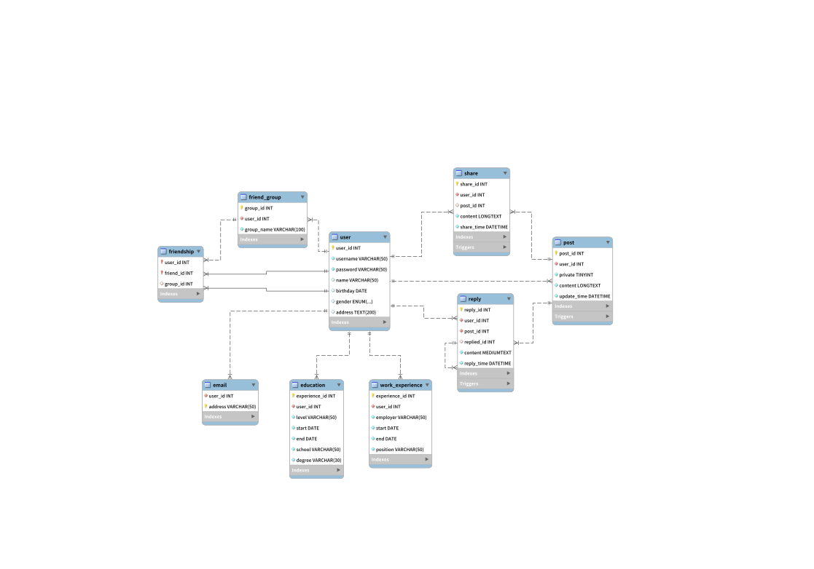

# DBMS Experiment 3

A social network database.

## ER Diagram



## Commands

* Personal Info

```
register username password
```

```
show info

update info (<attr_name>=<value>, ...)

save info
```

* Additional Info

```
search education (<attr_name>=<value>, ...)

show education [<education_id>]

add education (<attr_name>=<value>, ...)

update education <education_id> (<attr_name>=<value>, ...)

remove education <education_id>

save education [<education_id>]
```

```
search work (<attr_name>=<value>, ...)

show work [<work_id>]

add work (<attr_name>=<value>, ...)

update work <work_id> (<attr_name>=<value>, ...)

remove work <work_id>

save work [<work_id>]
```

* Friend

```
search user (<attr_name>=<value>, ...)

show friend [<username>]

add friend <username>

move <username> to <group_name>

move <username> out

remove friend <username>

save friend [<username>]
```

```
show friend_group

add friend_group (<attr_name>=<value>, ...)

update friend_group (<attr_name>=<value>, ...)

remove friend_group group_name

save friend_group
```

* Post

```
search post (<attr_name>=<value>, ...)

show post [<post_id>]

add post (<attr_name>=<value>, ...)

update post (<attr_name>=<value>, ...)

remove post <post_id>

save post [<post_id>]
```

* Reply

```
search reply (<attr_name>=<value>, ...)

show reply [<reply_id>]

add reply (<attr_name>=<value>, ...)

remove reply <reply_id>

save reply [<reply_id>]
```

* Share

```
search share (<attr_name>=<value>, ...)

show share [<share_id>]

add share (<attr_name>=<value>, ...)

remove share <share_id>

save share [<share_id>]
```
